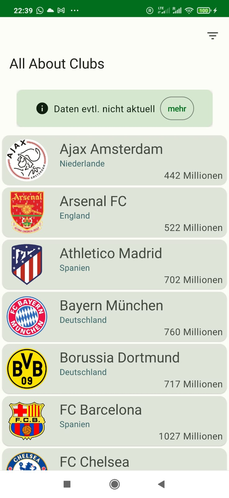
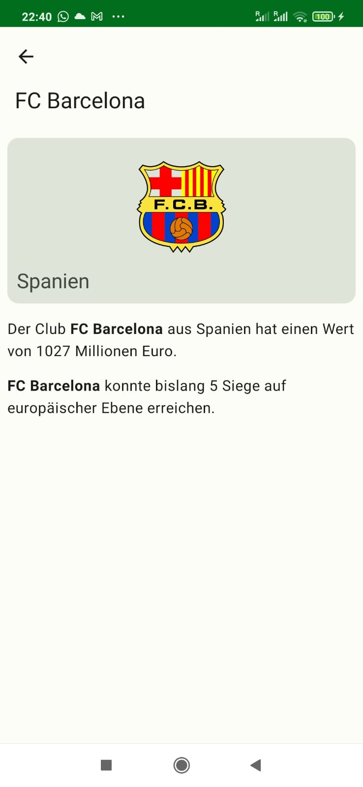
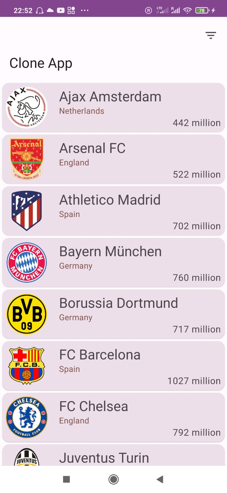

# AllAboutClubs 

Solarized dark             |  Solarized Ocean          |Solarized dark             |  Solarized Ocean
:-------------------------:|:-------------------------:|:-------------------------:|:-------------------------:
| |  | 
    
 
## App Funcionality

### General App Info: 
- I departed from the original wireframes and followed Googles brand new [Material Design 3](https://m3.material.io/components/cards/overview) guidelines throughout the app. This way the app is future-prof 
- Color Scheme was created by feeding the provided PrimaryColor: *#01C13B* to the [Material3 online Tool](https://m3.material.io/theme-builder#/custom)
- As per requirements the App features 2 flavours to allow for relaunching of the app in different markets: original and clone. In the Clone app I used a purple colorSchema otherwise its the same app. Other divergences in functionallity could be added later on
- SplashScreen is provided

### Home Screen
- The home screen displays a list of futball clubs with along with their insignia, country and valuation
- On startup data is loaded from a remote API and synched to the apps local Room Database from which they are then shown to the user 
- If data could not be retrieved, the list shows old data from Room 
- A Card informs the user if data might be outdated and also about loading processes and exceptions
- A toggleable action on the right of the TopBar allows to sort the list either by Club valuation or alphabetically; the list scrolls to the top when this happens
- Clicking of Club items leads to Detail Screen

### Detail Screen
- Displays details of individual Clubs
- Spannable formated text fields inform the user of Club details
- The topbar includes BackNavigation

## Clean architecture with 3 layers
- Data (for database and API code)
- Domain (for business logic (use cases) and models)
- Presentation (for UI logic, with MVVM)

## Tests
- Unit tests (only 2 basic tests as examples)
    
## Features
- UI made entirely using Jetpack Compose following Googles New [Material Design 3](https://m3.material.io/components/cards/overview)
- Dependency injection (with [Hilt](http://google.github.io/hilt/))
- Reactive programming with [Kotlin Flows](https://kotlinlang.org/docs/reference/coroutines/flow.html)
- Coil for Images (Glide performs better but Coil allows for more concise code in Kotlin/Compose)
- Retrifit2 + Moshi for network requests
- Android architecture components to share **ViewModels** during configuration changes, **Room** database for local caching, **Datastore** for persisting network call dates
- Coroutines
- Localization is provided in both German and English. Special methods were included to also Localize the Countries in the network response (which are always in German)
- Localization of Formated Strings is also fully provided despite Jetpack Composes shortcommings in this regard

# Getting started

### Script 
Download this repository extract and open it in Android Studio
And you're ready to install the app in Debug mode

# More
If you want to know more about my skills check out my Taxi App on Google play [Dale Viaje](https://play.google.com/store/apps/details?id=com.dale.viaje.nicaragua.customer).
